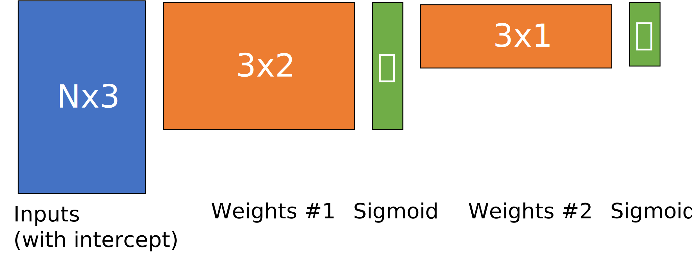

## Instructions

The coding and free response questions are due on November 8 at 11:59pm.
There are 22 points possible for this assignment, but it's graded out of 20.
If you earn an average of 19 points on all five assignments, you'll get an A.
With the extra credit from here (and participation), it's possible to get an A
without completing the fifth assignment.

### Setup (2 points)

These 2 points are extra credit, but have an earlier deadline of November 1.
All you need to do for these points is pass the `test_setup` test case, which
just requires putting your NetID in the `netid` file and creating PDF files
titled `XXX_qYYY.pdf` where `XXX` is replaced with your netid, and `YYY` ranges
from 1 to 5 (one per free-response question). At setup time, the content of
these PDFs won't be graded, this is just to ensure that you can set up your
repository to be autograded.

Your final submission must also pass the `test_setup` test, or you will lose
these points. If your final submission has any issues that prevent the autograder
from running your code or aggregating your PDF answers, you may lose these
points.

### Coding (10 points)

You need to write code in every function that raises a `NotImplementedError`
exception. Your code is graded automatically using the test cases in `tests/`.
To see what your grade is going to be, you can run `python -m pytest`; make
sure you have installed the packages from `requirements.txt` first. If the
autograder says you get 100/100, it means you get all 10 points.

Note that some autograder tests require previous tests to pass before you can
earn points. We recommend you write code to pass the tests in the order they
appear in `tests/rubric.json`.

Note that `test_custom_transform` may require significant trial and error and
is only worth 0.5 points towards your final grade. Please don't spend several
hours on it. After you've given it an initial try, please take a look at FRQ2;
you can get points for describing what you tried to do, even if you didn't pass
the test case.

### Free-response (10 points)

As before and as described above, each question should be answered in its own
PDF file. We will grade these anonymously; please do not include your name,
NetID, or other personally-identifying information. We may deduct points for
this if necessary.

## Free-reponse Questions

### 1. MNIST Classification (3 points)

The [MNIST dataset](https://en.wikipedia.org/wiki/MNIST_database) is a famous
image classification dataset of handwritten digits that has been used as a
benchmark for many years. In this question, you'll train a couple models to
classify those digits and compare the results.  Look at the code provided to
you in `free_response/q1.py`, which you can run with `python -m
free_response.q1`.

**a.** In `two_class()`, make tweaks to the dataset and hyperparameters by
editing these lines:
```python
X, y = load_digits(classes=(0, 1), n=None)
hidden_layer_sizes = (8, )
max_iter = 200
```

Run at least eight experiments using different settings: you can change
`classes`, `n`, `hidden_layer_sizes`, and `max_iter`. You can also tweak
`build_model()` if you want. 

For each experiment you run, write down the settings you chose and the results
that are printed out.  Then, describe what trends you notice across these
experiments. Do the results match up with what we discussed in class?  Does
anything surprise you?

**b.** In `ten_class()`, experiment with changes to the sklearn MLP by editing
the following lines:
```python
hidden_layer_sizes = (64,)
max_iter = 2000
sklearn_kwargs = {}
```

Run at least four experiments using different settings. You may want to check
the [sklearn.neural_network.MLPClassifier docs](
https://scikit-learn.org/stable/modules/generated/sklearn.neural_network.MLPClassifier.html)
to get a sense of the variety of arguments you can add into `sklearn_kwargs`.
For each experiment write down the settings you chose and the accuracies
printed out. Then, describe what trends you notice across these experiments.
What settings gave the best test set accuracy?  Did anything surprise you?

**c.** Try using your `Model` class in the `ten_class` function; it shouldn't
work. What substantial change (e.g., more than one line of code) you would have
to make to the code so that you could train a MLP that can learn to classify
ten classes of handwritten digits, rather than just two?

### 2. Custom transform and the spiral dataset (2 points)

**a.** Were you able to pass the `test_custom_transform` case? If so,
explain what you did. If not, explain what you tried to do and why.

**b.** Run `python -m free_response.q2`; it will show a figure and save a copy
to your `free_response_folder`.  Once you've run it once, take a look at the
code in `free_response/q2.py`. Try changing the number of hidden layers, nodes
per hidden layer, and activation functions.  Include in your PDF plots of at
least two decision boundaries that noticeably differ. How did the
hyperparameters you changed influence the decision boundary you learned?

**c.** Building off your changes to **a.**, try changing the regularization
parameters (`alpha` and `penalty`) to see how regularization affects the
decision boundaries you learn. Use the code to create two plots showing
different decision boundaries and explain how those boundaries are affected by
your choice of regularization.

### 3. Loss Landscapes and the Effects of Batching (1 point)

Remember from lecture that we mentioned three types of gradient descent:
"batch," which uses the entire dataset to compute the gradients; "stochastic,"
which uses only a single example at a time (as with perceptron); and "mini-batch,"
which uses a batch size in between 1 and the size of the dataset.

Read through the code in `free_response/q3.py` to understand what it's doing,
and then vary the `batch_size` argument to visualize how the loss landscape
changes between batches. When you run the code with `python -m free_response.q3`,
it will save figures to your `free_response/` folder.

**a.** Choose two batch sizes less than 20 such that the standard deviation
printed out in the last line of the main function is much larger for one batch
size than the other. Why does this happen? Feel free to include plots to back
up your explanation, but you must provide a written explanation.

**b.** What do your explorations tell you about the trade-off between batch
gradient descent, minibatch gradient descent, and stochastic gradient descent?

### 4. PyTorch autograd (1 point)

While we will not use PyTorch to build neural networks in this class (but you
should take CS449 Deep Learning with me in winter 2023!), it and machine
learning frameworks like it make it much easier to develop custom networks than
the `src/` directory of this homework might indicate.

To get a sense of why this is, read [this PyTorch tutorial](
https://pytorch.org/tutorials/beginner/deep_learning_60min_blitz.html). You'll
certainly need to read [A Gentle Introduction to
torch.autograd](https://pytorch.org/tutorials/beginner/blitz/autograd_tutorial.html),
but the sections titled "Tensors," and "Neural Networks," and "Training a
Classifier" will be helpful.

**a.** What is automatic differentiation? How does it relate to gradient
descent and back-propagation? Why is it important for PyTorch?

**b.** Why does PyTorch require that most arrays and matrices be stored in its
special tensor class (`torch.Tensor`) when `numpy` arrays are very similar?

### 5. The expressive power of nonlinearities (3 points)

Recall the multilayer perceptron we saw in lecture, copied below.



We wrote the entire network as `g(W2 @ g(W1 @ X))`, where `W1` is a 3x2 matrix,
`W2` is a 3x1 matrix, and `g` was the sigmoid function. `X` has two features,
but we convert it to a matrix of shape Nx3 by adding a column of 1s
for the intercept term. We also add an intercept to `g(W1 @ X)` to make it 
a Nx3 matrix as well.

Suppose we have:

- `X = np.array([[1, x1, x2]])`
- `W1 = np.array([[w1, w2], [w3, w4], [w5, w6]])`
- `W2 = np.array([[v1], [v2], [v3]])`

If we denote `g(W1 @ X) = np.array([[1, z1, z2]])`, then `g(W2 @ g(W1 @ X))` can
be written as `g(v1*1 + v2*z1 + v3*z2)`. Suppose that instead of the sigmoid function,
we let `g(x)` be a *linear* activation function, such that `g(x) = x`.

**a.** Rewrite `g(v1*1 + v2*z1 + v3*z2)` only in terms of `g, x1, x2, w1, ...,
w6, v1, v2, v3` so that its expression no longer uses `z1` or `z2`.

**b.** If we assume `g(x) = x`, can you use algebra to recombine the terms in
your answer to **a.** so that the entire network is expressed as `g(m*1 + n*x1 +
o*x2)` for some `m, n, o` that are each a function of `w1, w2, ... w6, v1, ...
v3`? If so, show how. If not, say why not.

**c.** What does this say about the expressive power of a MLP using linear
activation functions, as compared to a single linear perceptron?

**d.** Now, we'll repeat part **b.** using the sigmoid activation function,
where `g(x) = 1/(1 + np.exp(-x))`. Using this definition, can you use algebra
to recombine the terms in your answer to **a.** so that the entire network is
expressed as `g(m + n*x1 + o*x2)` for some `m, n, o` that are each a function
of `w1, w2, ... w6, v1, ... v3`? If so, show how. If not, say why not.

**e.** What does this say about the expressive power of a MLP using sigmoid
activation functions, as compared to a single sigmoid perceptron?

**f.** We mentioned in class a handful of other activation functions. For an
activation to be useful in a neural network, what are the two most important
properties it must have? One is related to this question, the other is related
to backpropagation. 
